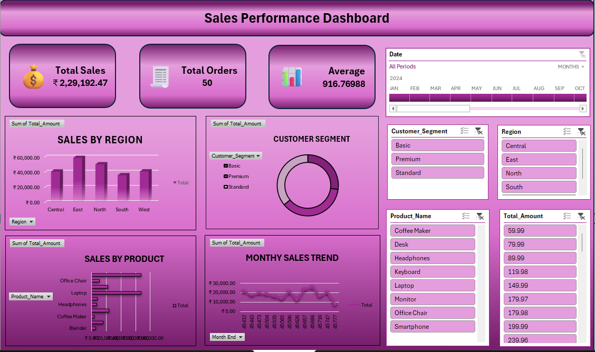

# 📊 Sales Performance Dashboard — Excel Project

An interactive and insightful **Excel Dashboard** built to analyze sales performance, revenue trends, customer behavior, and key business KPIs across regions, products, and customer segments.

---

## 🚀 Project Overview

This project presents a dynamic **Sales Performance Dashboard** created using **Microsoft Excel**. It provides a structured and visually appealing way to analyze:

- 💰 **Total Revenue** — ₹2,29,192.47
- 📦 **Total Transactions** — 250 Orders
- 📊 **Average Order Value** — ₹916.77
- 👥 **Customer Segments** — Basic, Premium, Standard
- 🌍 **Regional Coverage** — Central, East, North, South, West
- 🛍️ **Product Categories** — Electronics, Appliances, Furniture
- 📅 **Date Range** — April 2024 to April 2025

The dashboard empowers businesses to make **data-driven decisions** through interactive KPI cards, pivot charts, slicers, and trend analysis.

---

## 🖼️ Dashboard Preview

---

## 🗂️ Project Files

| File Name | Description |
|---|---|
| 📄 `FINAL_PROJECT.xlsx` | Main Excel workbook with all sheets |
| 🖼️ `Dash_board_preview.png` | Screenshot of the interactive dashboard |
| 📘 `README.md` | Project documentation |

---

## 🧩 Workbook Structure

The Excel file contains **8 dedicated sheets**, each serving a specific purpose:

| Sheet | Purpose |
|---|---|
| 📋 `Raw data` | Original dataset with 250 transactions & 14 columns |
| 🔬 `Analysis` | Extended data with derived columns (Month, Year, Customer Age, Sale Amount flags, SUMIFS) |
| 📊 `Pivot table` | Pivot summaries — Sales by Product, Region, Month & Customer Segment |
| 📈 `Charts` | All pivot charts powering the dashboard |
| 🖥️ `Dashboards` | Final interactive dashboard with slicers |
| 🧮 `Analysis Toolpak` | Regression analysis & statistical output |
| 📖 `- Data Storytelling` | Narrative insights from the data |
| 🔀 `WHAT-IF Analysis` | Goal Seek scenarios (e.g., target revenue by quantity) |

---

## 🔹 Dashboard Features

### 1️⃣ KPI Cards (Top Section)
| KPI | Value |
|---|---|
| 💰 Total Sales | ₹2,29,192.47 |
| 📦 Total Orders | 250 |
| 📊 Average Order Value | ₹916.77 |

### 2️⃣ Visual Analysis
- 📊 **Sales by Region** — Column chart comparing Central, East, North, South, West
- 🛍️ **Sales by Product** — Bar chart across 10 products (Laptop, Monitor, Office Chair, etc.)
- 🥧 **Customer Segment** — Donut chart for Basic, Premium & Standard segments
- 📈 **Monthly Sales Trend** — Line chart tracking revenue across Apr 2024 – Apr 2025

### 3️⃣ Interactive Slicers / Filters
- 📅 Date (Month-wise timeline)
- 👤 Customer Segment (Basic / Premium / Standard)
- 🌍 Region (Central / East / North / South / West)
- 🛒 Product Name
- 💵 Total Amount

---

## 📦 Dataset Details

| Column | Description |
|---|---|
| `Transaction_ID` | Unique transaction identifier |
| `Date` | Transaction date (Apr 2024 – Apr 2025) |
| `Customer_ID / Name` | Customer reference |
| `Product_ID / Name` | Product reference (10 products) |
| `Category` | Electronics, Appliances, Furniture |
| `Quantity` | Units purchased |
| `Unit_Price` | Price per unit |
| `Payment_Method` | Cash, Credit Card, Debit Card, PayPal |
| `Region` | Central, East, North, South, West |
| `Customer_Segment` | Basic, Premium, Standard |
| `Customer_Since` | Customer join date |
| `Total_Amount` | Transaction total (Quantity × Unit Price) |

---

## 🛠️ Tools & Techniques Used

**Microsoft Excel:**
- ✅ Pivot Tables & Pivot Charts
- ✅ Slicers for dynamic filtering
- ✅ Conditional Formatting
- ✅ Data Cleaning & Preparation
- ✅ Formula Functions: `TEXT`, `YEAR`, `DATEDIF`, `EOMONTH`, `NOW`, `IF`, `SUMIFS`
- ✅ Array Formulas
- ✅ Analysis ToolPak (Regression Analysis)
- ✅ Goal Seek (WHAT-IF Analysis)

---

## 📌 Key Insights

- ✔️ **East region** leads in total sales volume
- ✔️ **Premium segment** customers contribute the highest revenue
- ✔️ **Laptop & Monitor** are the top-performing products
- ✔️ Monthly trend reveals seasonal patterns across the year
- ✔️ Electronics is the dominant category by revenue

---

## 🎯 Business Use Cases

- 📈 Sales Performance Monitoring
- 🧠 Business Intelligence Reporting
- 📋 Executive Summary Dashboards
- 🎯 Marketing & Campaign Analysis
- 🏭 Inventory & Product Planning
- 📉 Regression-based Sales Forecasting

---

## 📈 How to Use

1. Download or clone this repository
2. Open `FINAL_PROJECT.xlsx` in Microsoft Excel
3. Enable editing when prompted
4. Navigate to the **Dashboards** sheet
5. Use the **slicers** (Date, Region, Segment, Product) to filter and explore data interactively
6. Explore other sheets for raw data, analysis, and WHAT-IF scenarios

---

## 🌟 Future Enhancements

- 🔷 Power BI Version with live refresh
- 🐍 Python-based data pipeline (Pandas + Matplotlib)
- 🤖 Automated data refresh via Power Query
- 📉 Forecasting Module using time-series analysis
- ☁️ Google Sheets / Looker Studio integration

---

## 👨‍💻 Author

**Priya savaliya**
📍 India :- Ahemadabad
    
---

## ⭐ If You Like This Project

Give this repository a ⭐ and feel free to **fork**, **contribute**, or **share** your feedback!

---

> 📊 *Turning Raw Data into Actionable Insights*
