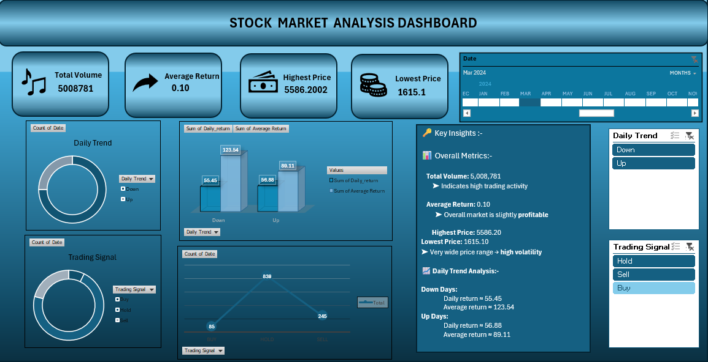

# 📈 Stock Market Analysis Dashboard — Excel Project

An interactive and insightful **Excel Dashboard** built to analyze stock market performance, trading signals, price trends, and key financial KPIs.

---

## 🚀 Project Overview

This project presents a dynamic **Stock Market Analysis Dashboard** created using **Microsoft Excel**. It provides a structured and visually appealing way to analyze:

- 📦 **Total Volume** — 5,008,781
- 📊 **Average Return** — 0.10
- 💹 **Highest Price** — 5,586.20
- 📉 **Lowest Price** — 1,615.10
- 📅 **Date Range** — July 2021 to March 2026
- 🔼 **Daily Trend** — Up / Down
- 🔔 **Trading Signals** — Buy / Hold / Sell

The dashboard empowers traders and analysts to make **data-driven investment decisions** through interactive KPI cards, pivot charts, slicers, and trend analysis.

---

## 🖼️ Dashboard Preview

---

## 🗂️ Project Files

| File Name | Description |
|---|---|
| 📄 `Priya_Practical_Exam.xlsx` | Main Excel workbook with all sheets |
| 🖼️ `Dash_board_preview.png` | Screenshot of the interactive dashboard |
| 📘 `README.md` | Project documentation |

---

## 🧩 Workbook Structure

The Excel file contains **5 dedicated sheets**, each serving a specific purpose:

| Sheet | Purpose |
|---|---|
| 📋 `Raw data` | Original dataset with 1,169 trading records & 17 columns |
| 🔬 `Analysis` | Extended data with derived columns (Daily Trend, Trading Signal, Average Return, XLOOKUP, XMATCH, MODE, etc.) |
| 📊 `Pivot Table` | Pivot summaries — Trend Summary, Average Return by Trend & Signal Distribution |
| 📈 `Charts` | All pivot charts powering the dashboard |
| 🖥️ `Dash Board` | Final interactive dashboard with slicers & Key Insights panel |

---

## 🔹 Dashboard Features

### 1️⃣ KPI Cards (Top Section)
| KPI | Value |
|---|---|
| 📦 Total Volume | 5,008,781 |
| 📊 Average Return | 0.10 |
| 💹 Highest Price | 5,586.20 |
| 📉 Lowest Price | 1,615.10 |

### 2️⃣ Visual Analysis
- 🍩 **Daily Trend** — Donut chart showing Up vs Down trading days
- 🍩 **Trading Signal** — Donut chart for Buy / Hold / Sell signal distribution
- 📊 **Average Return by Trend** — Clustered bar chart (Daily Return & Average Return for Up/Down days)
- 📈 **Signal Count Trend** — Line chart tracking Buy / Hold / Sell counts over time

### 3️⃣ Key Insights Panel
A dedicated **Key Insights** text panel embedded in the dashboard displaying:
- **Overall Metrics** — Total Volume, Average Return, Highest & Lowest Price, Volatility note
- **Daily Trend Analysis** — Daily return & average return breakdown for Down and Up days

### 4️⃣ Interactive Slicers / Filters
- 📅 Date (Month-wise timeline)
- 🔼 Daily Trend (Up / Down)
- 🔔 Trading Signal (Buy / Hold / Sell)

---

## 📦 Dataset Details

| Column | Description |
|---|---|
| `date` | Trading date (Jul 2021 – Mar 2026) |
| `open` | Opening price of the stock |
| `high` | Highest price of the day |
| `low` | Lowest price of the day |
| `close` | Closing price of the stock |
| `volume` | Number of shares traded |
| `ma_7` | 7-day Moving Average |
| `ma_30` | 30-day Moving Average |
| `ma_90` | 90-day Moving Average |
| `daily_return` | Percentage return for the day |
| `volatility_7` | 7-day rolling volatility |
| `volatility_30` | 30-day rolling volatility |
| `rsi` | Relative Strength Index |
| `macd` | MACD indicator value |
| `macd_signal` | MACD signal line value |
| `bb_upper` | Bollinger Band upper limit |
| `bb_lower` | Bollinger Band lower limit |

---

## 🛠️ Tools & Techniques Used

**Microsoft Excel:**
- ✅ Pivot Tables & Pivot Charts
- ✅ Slicers for dynamic filtering
- ✅ Conditional Formatting
- ✅ Data Cleaning & Preparation
- ✅ Formula Functions: `IF`, `AVERAGE`, `SUM`, `MAX`, `MIN`, `COUNTIF`, `SUMIF`, `TEXT`, `YEAR`, `ROUND`, `MODE`, `INDEX`, `MATCH`
- ✅ Advanced Lookup Functions: `XLOOKUP`, `XMATCH`
- ✅ Array Formulas
- ✅ Technical Indicators: RSI, MACD, Bollinger Bands, Moving Averages (MA7, MA30, MA90)

---

## 📌 Key Insights

- ✔️ **Total Volume of 5,008,781** indicates very high trading activity
- ✔️ **Average Return of 0.10** — overall market is slightly profitable
- ✔️ **Wide price range (1,615 – 5,586)** signals high volatility
- ✔️ **Down Days** — Daily return ≈ 55.45 | Average return ≈ 123.54
- ✔️ **Up Days** — Daily return ≈ 56.88 | Average return ≈ 89.11
- ✔️ **839 Hold signals** dominate, followed by 245 Sell and 85 Buy signals

---

## 🎯 Business Use Cases

- 📈 Stock Performance Monitoring
- 🧠 Trading Signal Generation (Buy / Hold / Sell)
- 📋 Investor & Analyst Reporting
- 🎯 Risk & Volatility Assessment
- 🏦 Portfolio Decision Support
- 📉 Technical Indicator Analysis (RSI, MACD, Bollinger Bands)

---

## 📈 How to Use

1. Download or clone this repository
2. Open `Priya_Practical_Exam.xlsx` in Microsoft Excel
3. Enable editing when prompted
4. Navigate to the **Dash Board** sheet
5. Use the **slicers** (Date, Daily Trend, Trading Signal) to filter and explore data interactively
6. Read the **Key Insights** panel on the right for a quick summary
7. Explore other sheets for raw data, analysis formulas, and pivot tables

---

## 🌟 Future Enhancements

- 🔷 Power BI Version with live market data refresh
- 🐍 Python-based data pipeline (Pandas + Matplotlib / Plotly)
- 🤖 Automated data refresh via Power Query
- 📉 Forecasting Module using time-series & ML models
- ☁️ Google Sheets / Looker Studio integration

---

## 👩‍💻 Author

**Priya Savaliya**
📍 India — Ahmedabad

---

## ⭐ If You Like This Project

Give this repository a ⭐ and feel free to **fork**, **contribute**, or **share** your feedback!

---

> 📊 *Turning Raw Market Data into Actionable Trading Insights*
